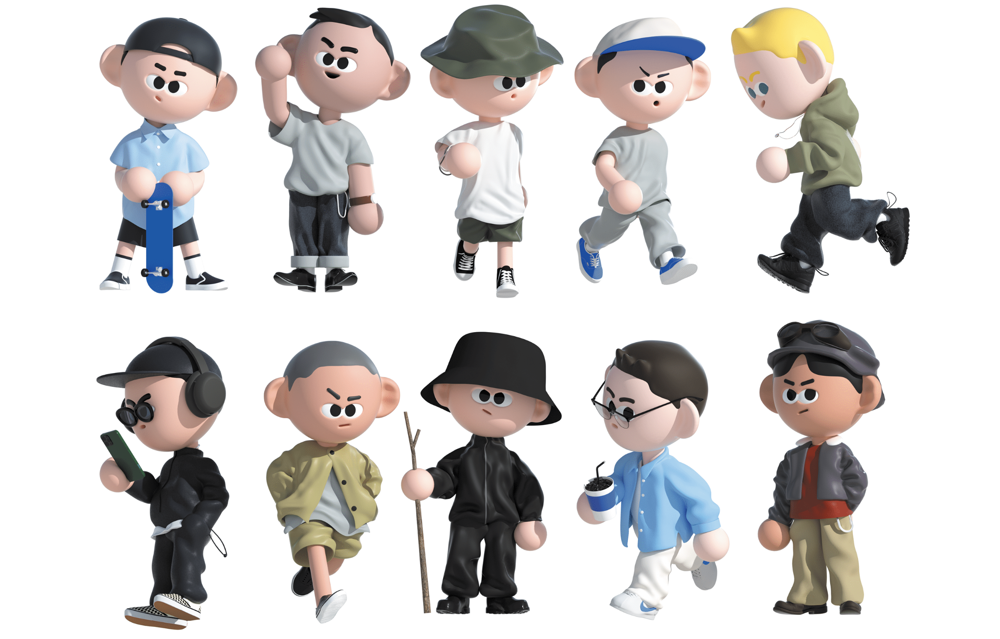

자동차 회사에서 품질 보증 업무를 하고 있습니다. (Infortainment system Quality Assurance)  

인문학과 러닝을 좋아합니다. 

## Education
**B.S. in** [Information Display](https://display.khu.ac.kr/display/user/contents/view.do?menuNo=3500007), Moved from [Global Eminence](http://globaleminence.khu.ac.kr/) _(2015 - 2021)_  
[*Kyunghee University*](https://www.khu.ac.kr/eng/main/index.do), Seoul, South Korea

## Research Interests
Online social behavior, Democracy of Social media, Explainable AI, AI ethics, Analog Semiconductor design

## Experience
**Quality Assurance Engineer**  
*Manager, Infortainment Quality Assurance Team Hyundai motors 2022.12 -*
  - Infortainment system, ETSC, Amp, Cluster Quality Assurance. 

**Digital Circuit Design Engineer**  
*Senior Engineer, VX Task LG Display 2021.01 - 2022.11*
  - VR pOLED Display, DDIC Development and FPCB Artwork, Display Module Reliability Test. 

**Summer Vacation X-ray Detecter Company Internship**  
*Research & Development 1 team, DRTECH(X-ray Detecter Company) 2019.07 - 2019.08*
  - Developed a upgrade X-ray detector with TFT Verification
 
## Skills

- **Programming Languages:** Python, C/C++, Assembly
- **Data Analysis:** nltk, spaCy, pandas, SciPy, scikit-learn, PySpark, MATLAB
- **Tools and Framework:** Visual Studio Code, Git/Github, LaTeX, MS Office, HTML, CSS

## Languages

Korean(Native), English(Advanced)

## Scholarships
**K-Honors sholarships** 
_Based on activities plan(2020)_

**Samsung Dreamclass sholarships** 
_Activities(Tutor)-based scholarships for six semesters (2018 ; 2020)_

**The Right Hands scholarships** 
_Merit-based scholarships for four semesters by [The Righthands](http://www.therighthands.or.kr/) (2019 ; 2020)_

**Samsong organization scholarships** 
_Merit-based scholarships for four semesters by [Samsong org.](http://www.samsong.org/info2.htm) (2019 ; 2020)_

**LGenius 10th scholarships** 
_Merit-based scholarships for four semesters by [LG Display](https://www.lgdisplay.com/kor/company/employ/job-application/domestic-lgenius) (2020 ; 2020)_

## Activities

- **Computer Programming Club LIKELION** _(2019 ; 2020)_  
    _Development website with Django and Teaching other programming language_
- **Military Services** _(2016 ; 2017)_  
    _Assistant to drill instructor for Reserve Forces, At 55 Devisions_
- **Korean University Council For Social Service Volunteer** _(2015)_  
    _Anyang 5-dong making better load, 사람사랑봉사단 녹음팀_
- **Korea Student Aid Foundation Readership Program** _(2015)_  
    _In Metee Learning Readership and Outactivities etc, Seoul, Korea_
- **Kyunghee University Undergraduate Student Council** _(2015)_  
    _A student council member_
- **Konkuk University Book club BOOKIST** _(2014)_  
    _In affliation with the Philosophy and Consiliene, Making book other conference for Dedate_